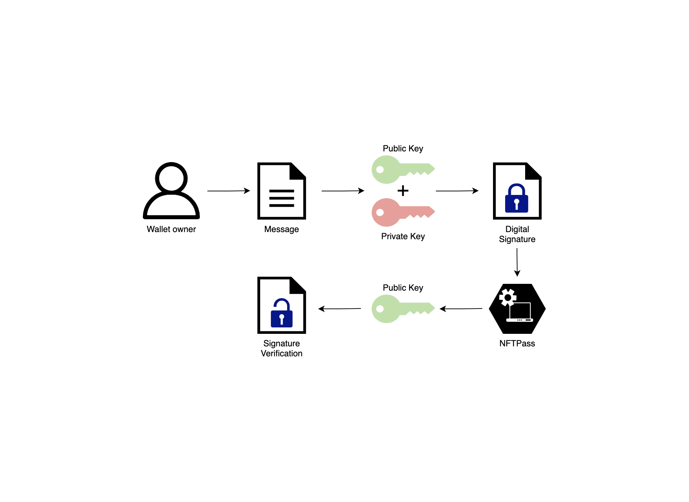

# Verification mechanism

Verification consists of three key steps:

- Verify crypto-wallet ownership
- Get the list of NFTs for the wallet
- Match NFT list with the configuration

## Verify crypto-wallet ownership

Signing a message is a cryptographic measure to prove your ownership of your blockchain address via the wallet (and the
associated private key).

A signed message is a great way to prove that you own your private keys without revealing them to anybody. It is
beneficial for everyone as a recipient can control that a transaction actually comes from the correct source, and it
protects the sender’s private keys and can be used as proof for a transaction.

You can find more technical details regarding how does signature
works [here](https://en.wikipedia.org/wiki/Digital_signature).

**The most important part is that NFTPass does not get any private information or gain access to funds. No operation on
the blockchain is being performed and thus, there are no gas fees.**

After performing this operation we are confident that the person owns this crypto-wallet without exposing any sensitive
information and allowing him to stay anonymous..

## Get the list of NFTs for the wallet

When we have the wallet public address and signed message, we can retrieve all the NFTs associated with this wallet. The
exact procedure might differ based on the NFT Contact type and blockchain network.

After we have a list of NFTs, all that is left is to understand if any of them match our set configuration.

## Match NFT list with the configuration

At the moment each NFTPass Application in the devcenter has a list of NFT Contact Addresses. Every NFT that matches
contract addresses from the list is treated as a match and is being returned on the client-side for further usage.

You can find out more about devcenter configuration on this page.

---
To learn more about how you can use NFTPass for these purposes, please,
review [dev center documentation](./dev-center.md) and [web verification documentation](./web-verification.md).

